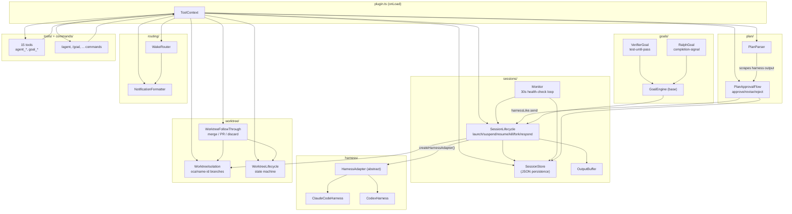
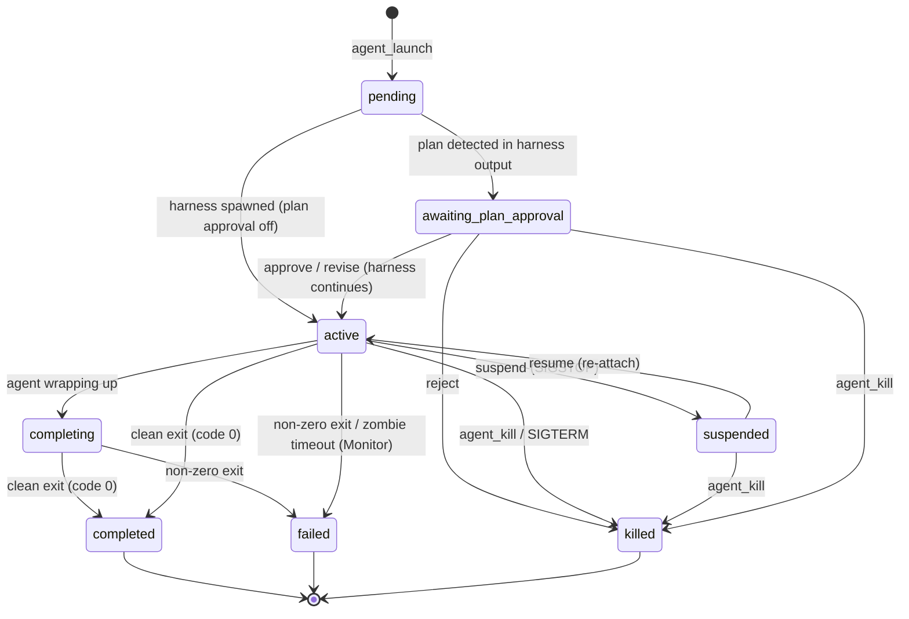
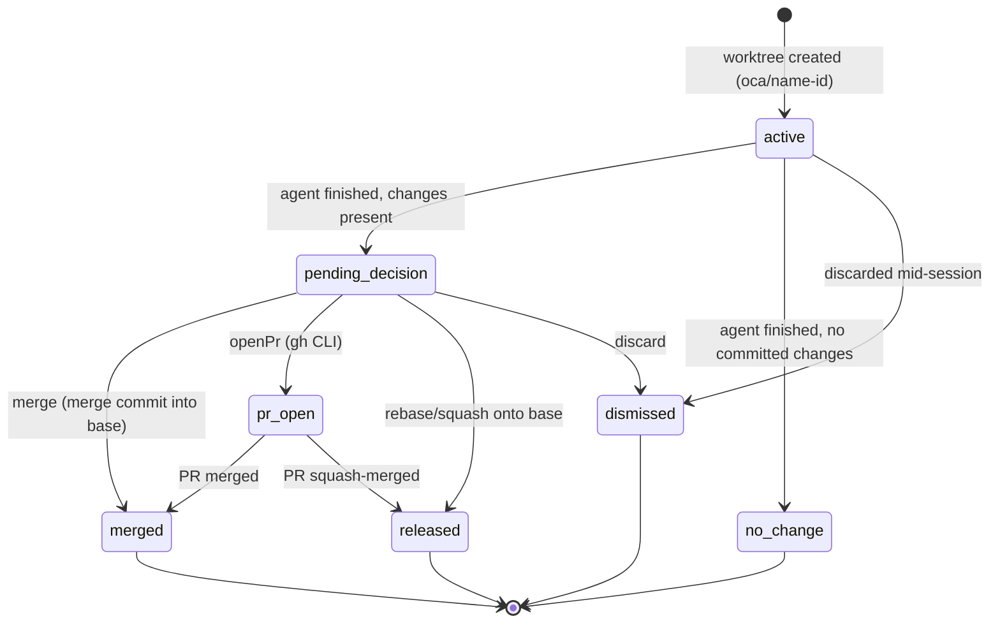
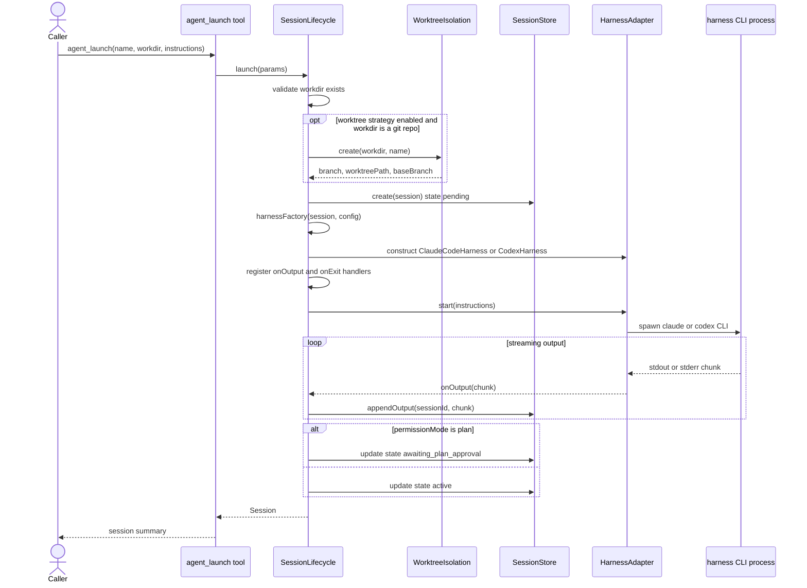
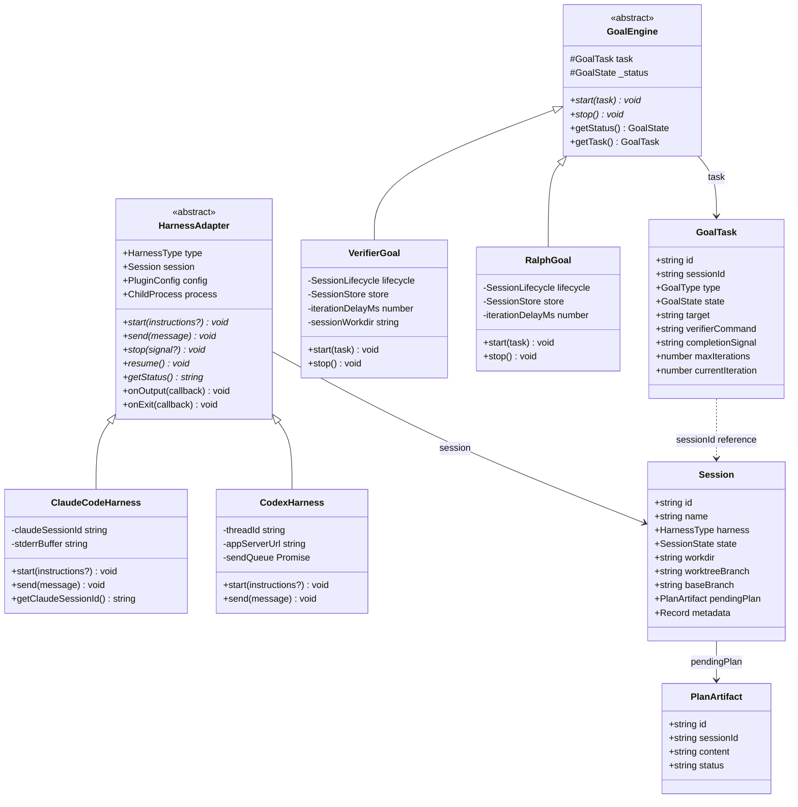

# OpenClaw Code Agent — Architecture Diagrams

Generated diagrams for the `openclaw-code-agent` plugin. Rendered SVGs live
alongside this file (`*.svg`); GitHub also renders the Mermaid blocks below
inline.

## System Architecture

How `plugin.ts` wires the subsystems together in `onLoad(ctx)`.

## Session Lifecycle

`SessionState` transitions driven by `SessionLifecycle`, `Monitor`, and
`PlanApprovalFlow`.

## Worktree Follow-Through Lifecycle

`WorktreeLifecycleState` transitions enforced by `WorktreeLifecycle`
(`TRANSITIONS` table in `worktree/lifecycle.ts`).

## Session Launch Sequence

How `agent_launch` flows through `SessionLifecycle.launch()`: optional
worktree creation, session record creation, harness spawn, output
streaming, and the final state split between `active` and
`awaiting_plan_approval` based on `config.permissionMode`.

## Harness & Goal Engine Class Hierarchy

The two abstract bases (`HarnessAdapter`, `GoalEngine`) and their concrete
subclasses, plus the core data interfaces from `types.ts` they operate on.

